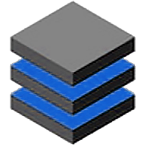

</img>
 

</img> &nbsp; 
</img> &nbsp;
</img> &nbsp;
</img> &nbsp;
</img> &nbsp;

# Project Portfolio: Inventoman

Welcome to my portfolio project repository! This is a work of mine that I've done on the Inventoman project as a freelancer.

# Project Overview

inventoman is a web-based application system for managing company assets from the time they are purchased until they are distributed to employees or returned by employees to company inventory. In this project, I was responsible for developing the web application using PHP programming language and CodeIgniter 4 as the main back-end programming stack and also using HTML, CSS, Bootstrap, JavaScript, Jquery and some other js library to build it's front-end.

# Project Details

Here are some of the details of the project:

- Client: PT. Daytech Tetra Sindo
- Duration: around 10 Days

## Technologies

- PHP 7.4
- CodeIgniter 4
- HTML
- CSS
- JavaScript
- Bootstrap 5.2.2
- Some other JavaScript library

# Project Achievements

Here are some of the key achievements of the project:

- Completing the project on time even less than the estimated time of 2 weeks
- Satisfied the client with the final results that exceed the client's expectations

# Project Challenges

Here are some of the challenges I faced while working on the project:

- Create the UI from bootstrap component and layouts from scratch but make it looks not too "Bootstrap Default" 
- Create the app as simple as possible but still full-filled the client needs

# Why I'm Sharing These Projects

I'm sharing these projects as part of my portfolio to showcase my skills and experience as a freelance developer. I hope that they demonstrate my ability to work with different clients and technologies and my commitment to delivering high-quality work.

# How to Use This Project

This project is meant to showcase my skills and experience as a freelance developer. You are welcome to explore the project and use it as inspiration for your own work.

**
However, please note that this project was done for a specific client and may not be suitable for your own needs. Please do not use any of the code or assets without permission.
**

## Installation Guide

1. [Download the portfolio release here](https://github.com/vkr16/inventoman/releases/tag/v1.0-portfolio)
2. Extract the zip to your server or localhost directory
3. Import `inventoman.sql` to your database server
4. Configure these variable in .env file
   - `app.baseURL = [YOUR BASE URL HERE | example: http://localhost/inventoman/]`
   - `database.default.hostname = [YOUR DATABASE HOST | example: localhost]`
   - `database.default.database = [YOUR DATABASE NAME | example: inventoman]`
   - `database.default.username = [YOUR DATABASE USERNAME | example: root]`
   - `database.default.password = [YOUR DATABASE PASSWORD | example: root]`

## Basic Usage Guide

1. Run the application by accessing the base url
2. Login with an account
   - Pre-registered account :
     - `Username = admin`
     - `Password = admin`
3. You can explore the rest of the features on this application by yourself

# Contact Me

If you have any questions about this project or would like to discuss a potential freelance opportunity, please feel free to contact me. My email address is fikri.droid16@gmail.com or visit my web page at [akuonline.my.id](https://akuonline.my.id).

Thank you for taking the time to review my project portfolio!

&copy; 2022 Fikri Miftah Akmaludin 

